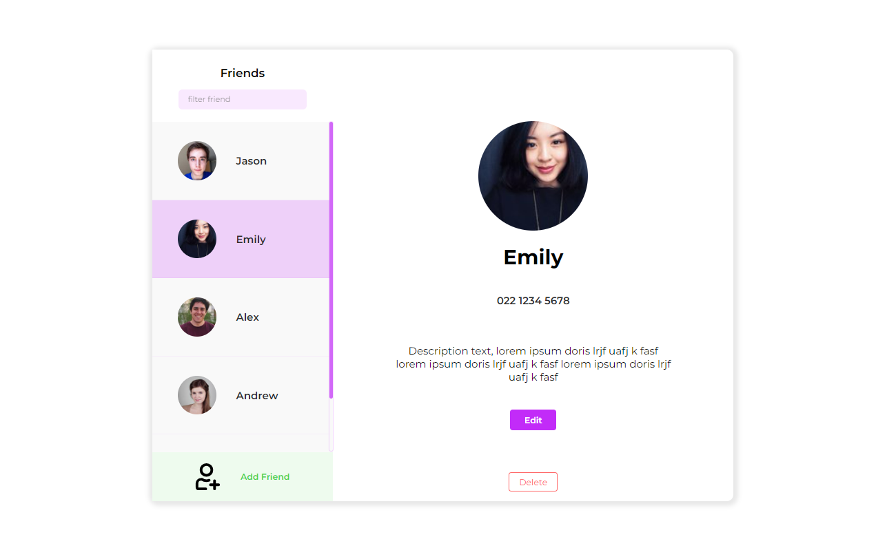

# WDCC HTML & CSS Workshop

The goal of this workshop is to learn some basic HTML and CSS.

Our goal is to create a user interface in a web page that will be the user interface for the application that will be developed across the series of workshops.

This workshop is designed for beginners, but we will be covering a lot of content in order to build a full page by the end of the workshop.

### Resources:

- Slides: [https://docs.google.com/presentation/d/17-i5pLCENpcKqJ-xOqaWo85nO7yaHfl9BoYYQ71MDX8/edit?usp=sharing](https://docs.google.com/presentation/d/17-i5pLCENpcKqJ-xOqaWo85nO7yaHfl9BoYYQ71MDX8/edit?usp=sharing)
- Zoom link for screenshare: [https://auckland.zoom.us/j/92794018821?pwd=UXgrR2RTMlJIaUppQXd6dnMvM3lUdz09](https://auckland.zoom.us/j/92794018821?pwd=UXgrR2RTMlJIaUppQXd6dnMvM3lUdz09)
- The IDE that will be used for the live demos: [https://code.visualstudio.com/](https://code.visualstudio.com/) 

### Useful links:

- W3Schools reference: [https://www.w3schools.com/html/default.asp](https://www.w3schools.com/html/default.asp)
- CSS Tricks Flexbox: [https://css-tricks.com/snippets/css/a-guide-to-flexbox/](https://css-tricks.com/snippets/css/a-guide-to-flexbox/)

### Timings:

- 11am: Introductions
- 11:05am: High-level Overview
- 11:15am: HTML & CSS theory
- 12pm: Practical Block #1
- 12:45pm: Break
- 12:55pm: Practical Block #2
- 1:40pm: Break
- 2:20pm: Theory Component #2
- 2:40pm: Practical Block #3

## Practical project for the workshop:

For this workshop, we will be creating a basic web page layout.

The workshop will be run as a live coding follow along session. We will go through the task slowly together so that we can investigate the key skills that we are covering.

You should work within the `exercise` directory. An extra copy of the code is included within the `live-demo` directory; the `live-demo` directory will be updated to include the code that is completed by the instructor during the session.

The live demo component is designed to allow various concepts and skills to be developed in a practical context; this is ideal for demonstrating the process of using a range of tools and techniques for developing & testing the page.

There will be help available during the session, so please make sure to ask for help.

When completed, the page should look something like this:

